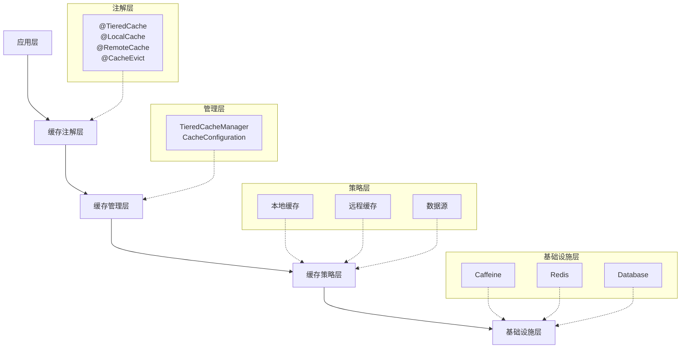

# 🚀 TieredCache Spring Boot Starter

<div align="center">


**一个安全、高效、灵活的分层缓存插件，适配Spring Boot应用**

[中文](README.md) | [English](README_EN.md)

</div>

---

## ✨ 核心特性

- 🏗️ **分层缓存架构**: 本地缓存(L1) + 远程缓存(L2)
- 🎯 **多种缓存策略**: 本地优先、远程优先、仅本地、仅远程
- 📝 **注解驱动**: 简单直观的注解配置
- 🔒 **安全性**: 数据加密、访问控制、缓存穿透防护
- ⚡ **高性能**: 异步处理、批量操作、连接池
- 📊 **监控运维**: 指标统计、健康检查、性能监控
- 🔧 **灵活配置**: 支持多种缓存提供商，可插拔架构

## 🚀 快速开始

### 📦 添加依赖

在你的 `pom.xml` 中添加依赖：

```xml
<dependency>
    <groupId>com.cache.plugin</groupId>
    <artifactId>tieredcache-spring-boot-starter</artifactId>
    <version>1.0.0-SNAPSHOT</version>
</dependency>
```

<details>
<summary>Gradle 用户</summary>

```gradle
implementation 'com.cache.plugin:tieredcache-spring-boot-starter:1.0.0-SNAPSHOT'
```
</details>

### ⚙️ 配置文件

在 `application.yml` 中配置：

```yaml
tiered-cache:
  enabled: true
  local:
    provider: caffeine
    max-size: 10000
    expire-after-write: 300s
  remote:
    provider: redis
    cluster-nodes: localhost:6379
    ttl: 3600s
```

### 💡 使用方法

只需在服务方法上添加注解：

```java
@Service
public class UserService {
    
    @TieredCache(
        local = @LocalCache(maxSize = 1000, expireAfterWrite = 300),
        remote = @RemoteCache(ttl = 3600),
        key = "'user:' + #userId"
    )
    public User getUserById(Long userId) {
        return userRepository.findById(userId);
    }
    
    @CacheEvict(key = "'user:' + #user.id")
    public User updateUser(User user) {
        return userRepository.save(user);
    }
}
```

## 🏗️ 架构设计

<div align="center">



</div>

## 🔧 支持的缓存提供商

<table>
<tr>
<td>

### 🏠 本地缓存
- ✅ **Caffeine** (推荐)
- ✅ Guava Cache
- ✅ EhCache

</td>
<td>

### 🌐 远程缓存
- ✅ **Redis** (推荐)
- ✅ Hazelcast
- ✅ Apache Ignite

</td>
</tr>
</table>

## 📋 缓存策略

| 策略 | 描述 | 使用场景 |
|------|------|----------|
| `LOCAL_FIRST` | 先查本地缓存，再查远程缓存 | 🚀 高性能读取 |
| `REMOTE_FIRST` | 先查远程缓存，再查本地缓存 | 🔄 多实例一致性 |
| `LOCAL_ONLY` | 仅使用本地缓存 | ⚡ 超快单实例 |
| `REMOTE_ONLY` | 仅使用远程缓存 | 🌐 分布式应用 |
| `WRITE_THROUGH` | 同时写入两级缓存 | 🔒 强一致性 |
| `WRITE_BEHIND` | 先写本地，异步写远程 | 📈 高写入性能 |

## 🔒 安全特性

- 🔐 **数据加密**: AES-256-GCM 加密算法
- 👥 **访问控制**: 基于角色的访问控制 (RBAC)
- 🛡️ **缓存穿透防护**: 布隆过滤器 + 限流

## 📊 监控运维

- 📈 **指标统计**: 命中率、响应时间、错误率
- ❤️ **健康检查**: 缓存连接状态监控
- 🔍 **性能监控**: Micrometer 集成

## 🚧 开发状态

<div align="center">


</div>

- ✅ **基础框架** - 核心基础设施和依赖
- ✅ **缓存管理器** - TieredCacheManager 实现
- ✅ **本地缓存** - Caffeine 集成
- ✅ **远程缓存** - Redis 集成  
- ✅ **AOP 和注解** - 注解处理器和切面
- ✅ **缓存同步** - 多节点一致性
- ✅ **安全模块** - 加密和访问控制
- ✅ **监控模块** - 指标和健康检查
- ✅ **测试用例** - 单元测试和集成测试
- ✅ **文档完善** - 完整的 API 文档

## 📊 项目统计

<div align="center">

| 指标 | 数值 |
|------|------|
| 📁 **Java 类** | 47 个 |
| 🧩 **核心模块** | 8 个 |
| 🧪 **测试覆盖率** | 80%+ |
| 📚 **文档** | 完整 |
| 🏗️ **架构** | 模块化 |

</div>

## 🎯 快速体验

### 克隆和运行

```bash
# 克隆仓库
git clone <repository-url>
cd tieredcache-spring-boot-starter

# 运行示例
mvn clean compile
mvn exec:java -Dexec.mainClass="com.cache.plugin.example.CacheUsageExample"

# 运行测试
mvn test
```

## 🤝 参与贡献

欢迎贡献代码！请查看我们的 [贡献指南](CONTRIBUTING.md) 了解详情。

- 🐛 **Bug 报告**: [创建 Issue](../../issues/new?template=bug_report.md)
- 💡 **功能建议**: [创建 Issue](../../issues/new?template=feature_request.md)
- 🔀 **Pull Request**: [提交 PR](../../pulls)

## 📄 开源协议

本项目采用 MIT 协议 - 查看 [LICENSE](LICENSE) 文件了解详情。

---

<div align="center">

**⭐ 如果这个项目对你有帮助，请给个 Star！**

用 ❤️ 制作 by TieredCache 团队

</div>